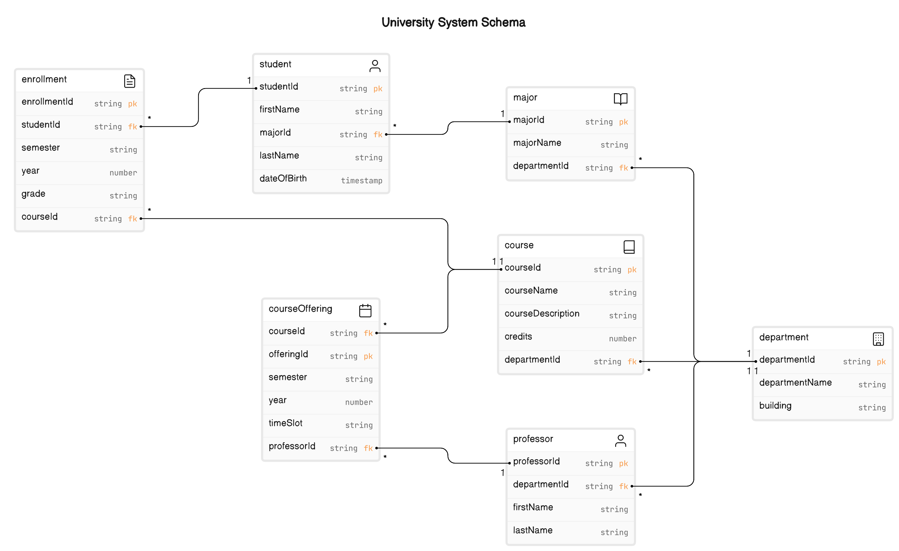

# Data Engineer Fundamentals  
### The 80-20 as Data Engineer you should know.

## CI/CD

#### Continuous Integration (CI)
Continuous Integration is the practice of automating the integration of code changes from multiple contributors into a single software project.
The main goal of CI is to provide rapid feedback so that if a defect is introduced into the code base, it can be identified and corrected as soon as possible.

CI processes typically involve:

**Automated Testing**: Running automated tests every time new code changes are integrated into the main branch of the repository to ensure they don't break the existing codebase.  
**Version Control**: Use of version control systems (like Git) to manage code changes and ensure that developers are always working with the latest version.  
**Build Automation**: Automatically compiling code and running tests to verify that the software is in a good state to be deployed.  

#### Continuous Deployment (CD)
Continuous Deployment extends CI by automatically deploying all code changes to a testing or production environment after the build stage.
This means that every change that passes all stages of your production pipeline is released to your customers automatically, without manual intervention.
This process includes:

**Automated Deployments:** The use of scripts or automation tools to deploy applications automatically to various environments (development, staging, production).   
**Environment Consistency:** Keeping all deployment environments as similar as possible to reduce the chances of bugs occurring due to environment-specific configurations.  
**Rollback Mechanisms:** Having the ability to quickly revert deployments if issues are detected post-release.  

## Database

### OLAP vs OLTP

`OLAP (Online Analytical Processing)` and `OLTP (Online Transaction Processing)` are two types of data processing systems used for different purposes in database management.

**OLAP**  
OLAP systems are designed for complex queries and data analysis. They are optimized for reading and analyzing large amounts of data quickly, often from multiple database systems.
OLAP is used primarily for business intelligence and data mining, supporting decision-making processes.
It operates on aggregated and historical data, allowing for trends and patterns to be identified over time.

**OLTP**  
OLTP systems are optimized for managing transaction-oriented applications. They are used for handling large numbers of short online transactions (Insert, Update, Delete).
The main focus is on efficiency of data processing, with an emphasis on speed, concurrency, and reliability.
OLTP systems are typically used for order entry, retail sales, and financial transactions.

In summary, OLAP is used for data analysis and decision support, focusing on complex queries over large data sets, while OLTP is focused on quick transaction processing and efficiency in handling large numbers of transactions.

*Bonus Extra*(in Spanish) There is a chapter in my old podcast [podcas olap-vs-oltp](https://podcasts.apple.com/au/podcast/olap-vs-oltp/id1490752470?i=1000459232747)

### OLTP: ER-Schema

Example of simple relational schema for a university system based on the entities we discussed earlier. 
This schema will detail each table along with its primary keys (PK) and foreign keys (FK) and describe the relationships between the tables.

#### Tables and Their Attributes

1. **Student**
   - **StudentID** (PK): A unique identifier for each student.
   - **FirstName**: The first name of the student.
   - **LastName**: The last name of the student.
   - **DateOfBirth**: The date of birth of the student.
   - **MajorID** (FK): References the Major table to indicate what major the student is studying.

2. **Professor**
   - **ProfessorID** (PK): A unique identifier for each professor.
   - **FirstName**: The first name of the professor.
   - **LastName**: The last name of the professor.
   - **DepartmentID** (FK): References the Department table where the professor belongs.

3. **Course**
   - **CourseID** (PK): A unique identifier for each course.
   - **CourseName**: The name of the course.
   - **CourseDescription**: A brief description of what the course covers.
   - **Credits**: The number of credits the course is worth.
   - **DepartmentID** (FK): References the Department offering the course.

4. **Department**
   - **DepartmentID** (PK): A unique identifier for each department.
   - **DepartmentName**: The name of the department.
   - **Building**: The building in which the department is located.

5. **Enrollment**
   - **EnrollmentID** (PK): A unique identifier for each enrollment record.
   - **StudentID** (FK): References the Student involved in the enrollment.
   - **CourseID** (FK): References the Course in which the student is enrolled.
   - **Semester**: Indicates the semester during which the enrollment is valid.
   - **Year**: The year of the enrollment.
   - **Grade**: The grade received by the student for the course.

6. **Major**
   - **MajorID** (PK): A unique identifier for each major.
   - **MajorName**: The name of the major.
   - **DepartmentID** (FK): References the Department that offers the major.

7. **CourseOffering**
   - **OfferingID** (PK): A unique identifier for each course offering.
   - **CourseID** (FK): References the Course being offered.
   - **ProfessorID** (FK): References the Professor teaching the course.
   - **Semester**: The semester during which the course is offered.
   - **Year**: The year in which the course is offered.
   - **TimeSlot**: The time slot of the course offerings.

#### Relationships

- **Students** are linked to **Majors** through MajorID.
- **Professors** are linked to **Departments** through DepartmentID.
- **Courses** are linked to **Departments**.
- **Enrollments** link **Students** and **Courses** to track which student is in which course.
- **Majors** are offered by **Departments**.
- **Course Offerings** link **Courses** with **Professors**, indicating who teaches what and when.

This schema provides a comprehensive view of how the tables are interconnected within a university's database, illustrating the relationships that help manage the academic and administrative data.
Each table is normalized to ensure data integrity and reduce redundancy. 

### OLAP

To evolve your ER schema into a dimensional schema for an OLAP (Online Analytical Processing) system, we would typically create a star schema or a snowflake schema.
These schemas are designed to optimize query performance and simplify the design for complex analytical queries.
Let’s break down the transformation using a **star schema** approach, which is a common method used in data warehousing.

#### Step 1: Identify the Fact Table

The **fact table** contains measurable, quantitative data about a business process. In the context of a university system, the "Enrollment" table is a good candidate for a fact table as it involves measurable events (course enrollments) that can be analyzed in various dimensions (student, course, time, etc.).

**Fact Table: Enrollments**
- **Attributes**:
  - EnrollmentID (Primary Key)
  - StudentID (Foreign Key)
  - CourseID (Foreign Key)
  - Semester (might split into two fields, Semester and Year for easier analysis)
  - Grade (Numeric score or categorical data)

### Step 2: Define Dimension Tables

Dimension tables store attributes related to dimensions of the fact table that are used to filter, group, or label data.
The dimensions for the "Enrollments" fact table would generally be "Student", "Course", "Professor", "Department", "Major", and a new "Time" dimension that we might need to create.

**Dimension Tables**:

1. **Student Dimension**
   - StudentID (PK)
   - FirstName
   - LastName
   - DateOfBirth
   - MajorID (as a descriptive attribute linking to the Major dimension)

2. **Course Dimension**
   - CourseID (PK)
   - CourseName
   - CourseDescription
   - Credits
   - DepartmentID (as a descriptive attribute)

3. **Professor Dimension**
   - ProfessorID (PK)
   - FirstName
   - LastName
   - DepartmentID (as a descriptive attribute)

4. **Department Dimension**
   - DepartmentID (PK)
   - DepartmentName
   - Building

5. **Major Dimension**
   - MajorID (PK)
   - MajorName
   - DepartmentID (as a descriptive attribute)

6. **Time Dimension** (created to analyze trends over time)
   - SemesterID (PK, composite key made from Year and Semester)
   - Year
   - Semester

### Step 3: Simplify Relationships

In a star schema, dimension tables are directly connected to the fact table but not to each other. 
Each dimension table should include attributes that help describe the fact table records without needing to join multiple tables:

- Foreign keys in the fact table (Enrollments) should correspond directly to the primary keys in each dimension table.
- The time dimension is particularly useful for analysis and should be detailed enough to allow for various time-based queries.

### Step 4: Consider Adding Aggregates or Calculated Fields

In some cases, adding calculated fields directly to the fact table can speed up certain types of analysis:

- Pre-calculated fields like "TotalCredits" for a semester can be stored in the fact table to speed up performance.
- Including fields like "Pass/Fail" based on the Grade could also be beneficial for quick querying.

### Implementation Considerations

- **Data Granularity**: Ensure the level of detail in the fact table aligns with the intended analytical queries.
- **Indexing and Partitioning**: Proper indexing and partitioning of the tables, especially the fact table, can improve query performance significantly.
- **Data Refresh Strategy**: Define how often the data in the data warehouse should be refreshed from the operational databases.

By restructuring your data into this dimensional schema, you can facilitate faster and more efficient querying which is essential for OLAP systems used in decision support and business intelligence.